# Diagramas de Sequência — BrainCoins

Cada seção abaixo contém o código PlantUML do diagrama de sequência correspondente a um caso de uso do sistema.

---

## Índice Resumido

| UC | Nome | Ator Principal |
|:--:|------|---------------|
| UC01 | Cadastrar Login e Senha | Usuário (todos os perfis) |
| UC02 | Criar Conta (Aluno) | Aluno |
| UC03 | Criar Conta (Empresa) | Empresa |
| UC04 | Pré-cadastrar Instituição via CSV | Instituição |
| UC05 | Pré-cadastrar Professor (Automático) | Sistema (via UC04) |
| UC06 | Receber Moedas Semestrais | Sistema (@Scheduled) |
| UC07 | Distribuir Moedas | Professor |
| UC08 | Cancelar Operação por Saldo Insuficiente (Professor) | Professor |
| UC09 | Consultar Extrato | Aluno / Professor |
| UC10 | Receber Moedas (visualização) | Aluno |
| UC11 | Notificar Aluno por E-mail | Sistema (async via UC07) |
| UC12 | Resgatar Vantagem | Aluno |
| UC13 | Cancelar Operação por Saldo Insuficiente (Aluno) | Aluno |
| UC14 | Enviar E-mail de Confirmação de Resgate | Sistema (async via UC12) |
| UC15 | Cancelar Resgate Expirado | Sistema (@Scheduled) |
| UC16 | Comunicar Aluno via E-mail (Reembolso) | Sistema (async via UC15/UC19) |
| UC17 | Cadastrar Vantagem | Empresa |
| UC18 | Confirmar Resgate | Empresa |
| UC19 | Reembolsar Aluno | Empresa |

---

## UC01 — Cadastrar Login e Senha

> **Ator:** Usuário (Aluno, Professor, Empresa ou Instituição)  
> **Trigger:** Usuário acessa `/auth/{role}` e submete credenciais

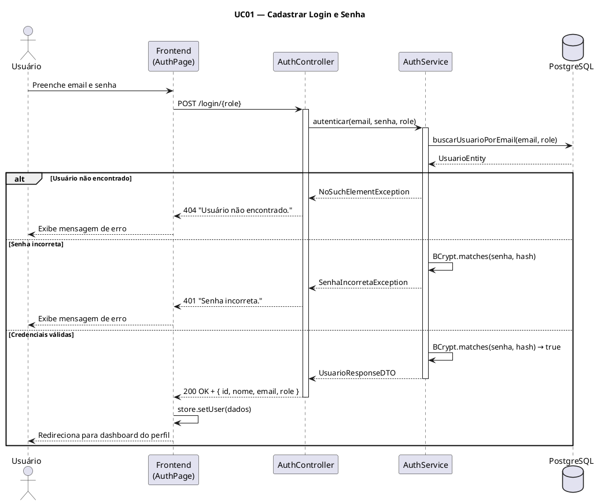
```plantuml
@startuml UC01 - Cadastrar Login e Senha
title UC01 — Cadastrar Login e Senha

actor "Usuário" as U
participant "Frontend\n(AuthPage)" as FE
participant "AuthController" as AC
participant "AuthService" as AS
database "PostgreSQL" as DB

U -> FE: Preenche email e senha
FE -> AC: POST /login/{role}
activate AC

AC -> AS: autenticar(email, senha, role)
activate AS

AS -> DB: buscarUsuarioPorEmail(email, role)
DB --> AS: UsuarioEntity

alt Usuário não encontrado
    AS --> AC: NoSuchElementException
    AC --> FE: 404 "Usuário não encontrado."
    FE --> U: Exibe mensagem de erro
else Senha incorreta
    AS -> AS: BCrypt.matches(senha, hash)
    AS --> AC: SenhaIncorretaException
    AC --> FE: 401 "Senha incorreta."
    FE --> U: Exibe mensagem de erro
else Credenciais válidas
    AS -> AS: BCrypt.matches(senha, hash) → true
    AS --> AC: UsuarioResponseDTO
    deactivate AS
    AC --> FE: 200 OK + { id, nome, email, role }
    deactivate AC
    FE -> FE: store.setUser(dados)
    FE --> U: Redireciona para dashboard do perfil
end
@enduml
```

---

## UC02 — Criar Conta (Aluno)

> **Ator:** Aluno  
> **Trigger:** Aluno acessa formulário de cadastro e submete dados

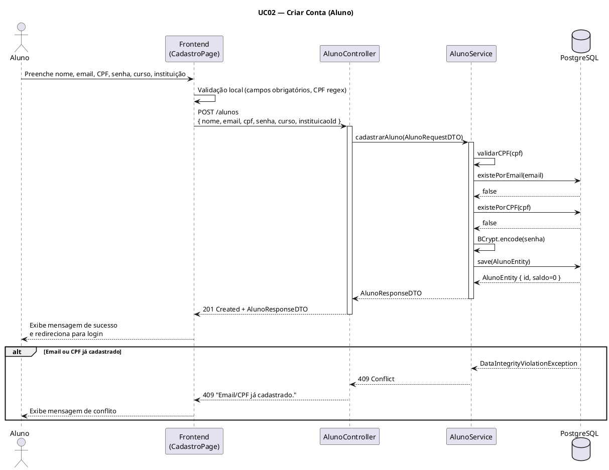
```plantuml
@startuml UC02 - Criar Conta (Aluno)
title UC02 — Criar Conta (Aluno)

actor "Aluno" as A
participant "Frontend\n(CadastroPage)" as FE
participant "AlunoController" as AC
participant "AlunoService" as AS
database "PostgreSQL" as DB

A -> FE: Preenche nome, email, CPF, senha, curso, instituição
FE -> FE: Validação local (campos obrigatórios, CPF regex)
FE -> AC: POST /alunos\n{ nome, email, cpf, senha, curso, instituicaoId }
activate AC

AC -> AS: cadastrarAluno(AlunoRequestDTO)
activate AS

AS -> AS: validarCPF(cpf)
AS -> DB: existePorEmail(email)
DB --> AS: false

AS -> DB: existePorCPF(cpf)
DB --> AS: false

AS -> AS: BCrypt.encode(senha)
AS -> DB: save(AlunoEntity)
DB --> AS: AlunoEntity { id, saldo=0 }

AS --> AC: AlunoResponseDTO
deactivate AS
AC --> FE: 201 Created + AlunoResponseDTO
deactivate AC
FE --> A: Exibe mensagem de sucesso\ne redireciona para login

alt Email ou CPF já cadastrado
    DB --> AS: DataIntegrityViolationException
    AS --> AC: 409 Conflict
    AC --> FE: 409 "Email/CPF já cadastrado."
    FE --> A: Exibe mensagem de conflito
end
@enduml
```

.png)

---

## UC03 — Criar Conta (Empresa)

> **Ator:** Empresa  
> **Trigger:** Empresa acessa formulário de cadastro e submete dados

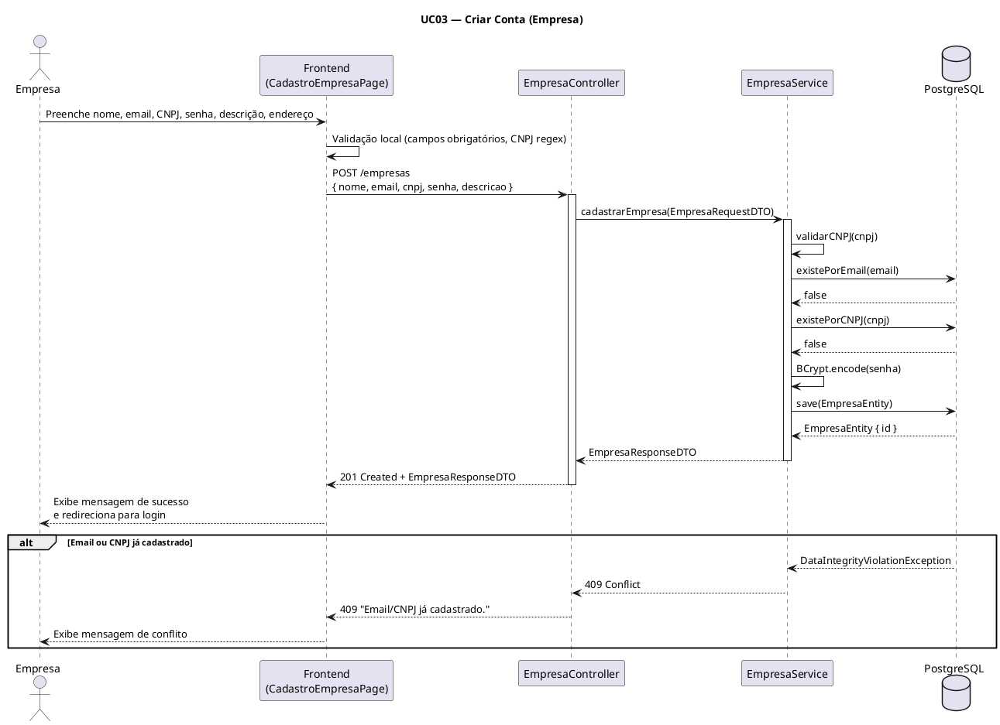
```plantuml
@startuml UC03 - Criar Conta (Empresa)
title UC03 — Criar Conta (Empresa)

actor "Empresa" as E
participant "Frontend\n(CadastroEmpresaPage)" as FE
participant "EmpresaController" as EC
participant "EmpresaService" as ES
database "PostgreSQL" as DB

E -> FE: Preenche nome, email, CNPJ, senha, descrição, endereço
FE -> FE: Validação local (campos obrigatórios, CNPJ regex)
FE -> EC: POST /empresas\n{ nome, email, cnpj, senha, descricao }
activate EC

EC -> ES: cadastrarEmpresa(EmpresaRequestDTO)
activate ES

ES -> ES: validarCNPJ(cnpj)
ES -> DB: existePorEmail(email)
DB --> ES: false

ES -> DB: existePorCNPJ(cnpj)
DB --> ES: false

ES -> ES: BCrypt.encode(senha)
ES -> DB: save(EmpresaEntity)
DB --> ES: EmpresaEntity { id }

ES --> EC: EmpresaResponseDTO
deactivate ES
EC --> FE: 201 Created + EmpresaResponseDTO
deactivate EC
FE --> E: Exibe mensagem de sucesso\ne redireciona para login

alt Email ou CNPJ já cadastrado
    DB --> ES: DataIntegrityViolationException
    ES --> EC: 409 Conflict
    EC --> FE: 409 "Email/CNPJ já cadastrado."
    FE --> E: Exibe mensagem de conflito
end
@enduml
```

.png)

---

## UC04 — Pré-cadastrar Instituição via CSV

> **Ator:** Instituição  
> **Trigger:** Gestor faz upload de arquivo CSV contendo dados de professores

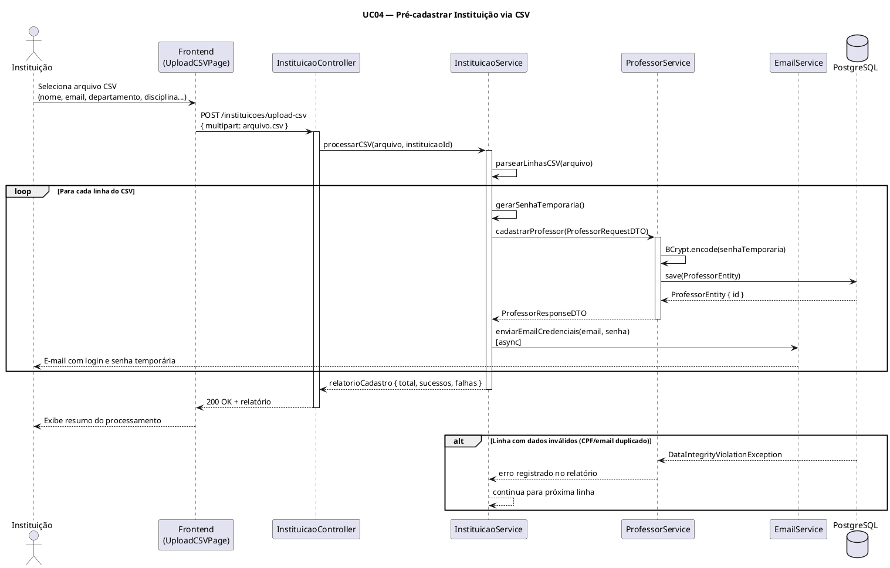
```plantuml
@startuml UC04 - Pre-cadastrar Instituicao (CSV)
title UC04 — Pré-cadastrar Instituição via CSV

actor "Instituição" as I
participant "Frontend\n(UploadCSVPage)" as FE
participant "InstituicaoController" as IC
participant "InstituicaoService" as IS
participant "ProfessorService" as PS
participant "EmailService" as ES
database "PostgreSQL" as DB

I -> FE: Seleciona arquivo CSV\n(nome, email, departamento, disciplina...)
FE -> IC: POST /instituicoes/upload-csv\n{ multipart: arquivo.csv }
activate IC

IC -> IS: processarCSV(arquivo, instituicaoId)
activate IS

IS -> IS: parsearLinhasCSV(arquivo)
loop Para cada linha do CSV
    IS -> IS: gerarSenhaTemporaria()
    IS -> PS: cadastrarProfessor(ProfessorRequestDTO)
    activate PS
    PS -> PS: BCrypt.encode(senhaTemporaria)
    PS -> DB: save(ProfessorEntity)
    DB --> PS: ProfessorEntity { id }
    PS --> IS: ProfessorResponseDTO
    deactivate PS
    IS -> ES: enviarEmailCredenciais(email, senha)\n[async]
    ES --> I: E-mail com login e senha temporária
end

IS --> IC: relatorioCadastro { total, sucessos, falhas }
deactivate IS
IC --> FE: 200 OK + relatório
deactivate IC
FE --> I: Exibe resumo do processamento

alt Linha com dados inválidos (CPF/email duplicado)
    DB --> PS: DataIntegrityViolationException
    PS --> IS: erro registrado no relatório
    IS --> IS: continua para próxima linha
end
@enduml
```

.png)

---

## UC05 — Pré-cadastrar Professor (Automático)

> **Ator:** Instituição  
> **Trigger:** Incluso no fluxo de UC04 — cada professor é cadastrado individualmente com credenciais geradas automaticamente

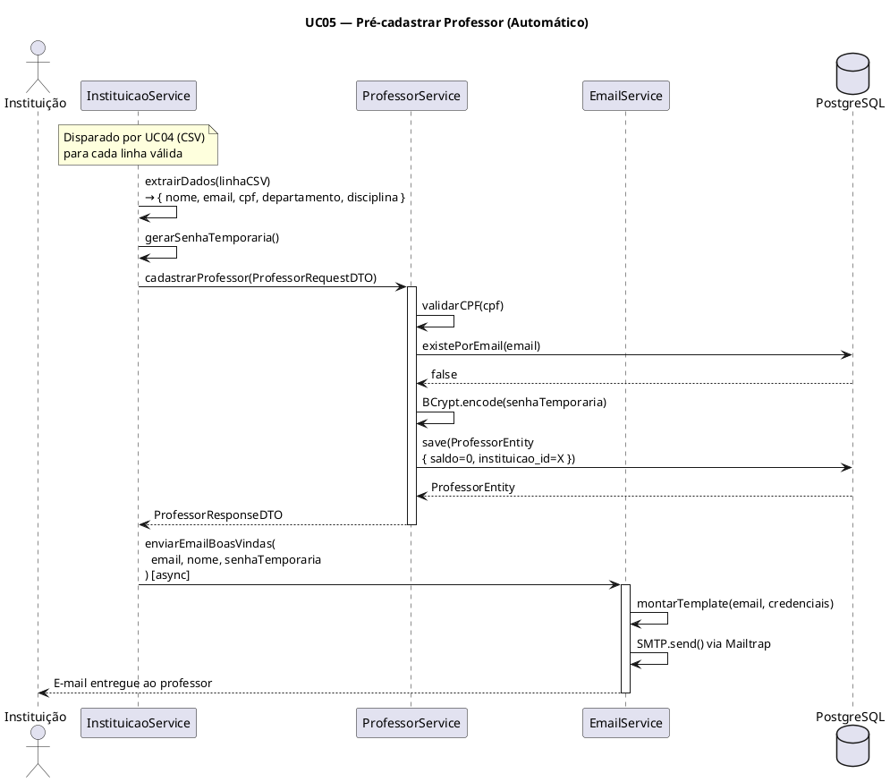
```plantuml
@startuml UC05 - Pre-cadastrar Professor (auto)
title UC05 — Pré-cadastrar Professor (Automático)

actor "Instituição" as I
participant "InstituicaoService" as IS
participant "ProfessorService" as PS
participant "EmailService" as ES
database "PostgreSQL" as DB

note over IS: Disparado por UC04 (CSV)\npara cada linha válida

IS -> IS: extrairDados(linhaCSV)\n→ { nome, email, cpf, departamento, disciplina }
IS -> IS: gerarSenhaTemporaria()

IS -> PS: cadastrarProfessor(ProfessorRequestDTO)
activate PS

PS -> PS: validarCPF(cpf)
PS -> DB: existePorEmail(email)
DB --> PS: false

PS -> PS: BCrypt.encode(senhaTemporaria)
PS -> DB: save(ProfessorEntity\n{ saldo=0, instituicao_id=X })
DB --> PS: ProfessorEntity

PS --> IS: ProfessorResponseDTO
deactivate PS

IS -> ES: enviarEmailBoasVindas(\n  email, nome, senhaTemporaria\n) [async]
activate ES
ES -> ES: montarTemplate(email, credenciais)
ES -> ES: SMTP.send() via Mailtrap
ES --> I: E-mail entregue ao professor
deactivate ES
@enduml
```

.png)

---

## UC06 — Receber Moedas Semestrais (Professor)

> **Ator:** Sistema (SemestreScheduler — automático)  
> **Trigger:** Job agendado executa a cada início de semestre (Spring Scheduling)

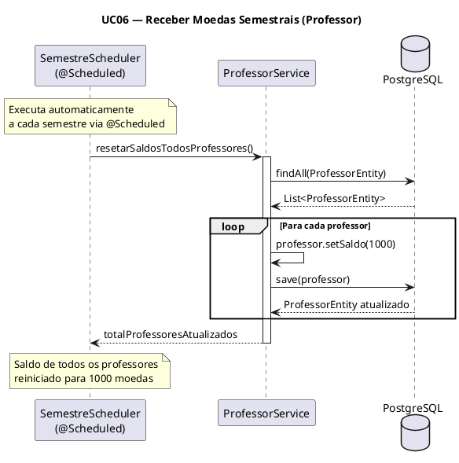
```plantuml
@startuml UC06 - Receber Moedas Semestrais
title UC06 — Receber Moedas Semestrais (Professor)

participant "SemestreScheduler\n(@Scheduled)" as SS
participant "ProfessorService" as PS
database "PostgreSQL" as DB

note over SS: Executa automaticamente\na cada semestre via @Scheduled

SS -> PS: resetarSaldosTodosProfessores()
activate PS

PS -> DB: findAll(ProfessorEntity)
DB --> PS: List<ProfessorEntity>

loop Para cada professor
    PS -> PS: professor.setSaldo(1000)
    PS -> DB: save(professor)
    DB --> PS: ProfessorEntity atualizado
end

PS --> SS: totalProfessoresAtualizados
deactivate PS

note over SS: Saldo de todos os professores\nreiniciado para 1000 moedas
@enduml
```

---

## UC07 — Distribuir Moedas (Professor → Aluno)

> **Ator:** Professor  
> **Trigger:** Professor seleciona aluno, quantidade e motivo e confirma a distribuição

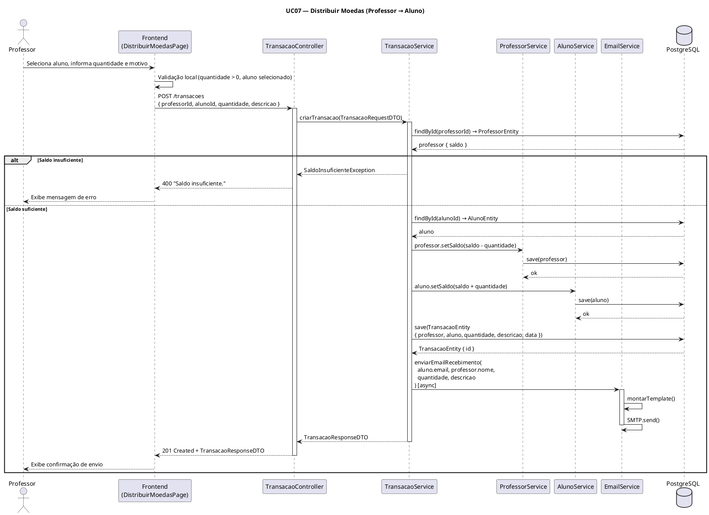
```plantuml
@startuml UC07 - Distribuir Moedas
title UC07 — Distribuir Moedas (Professor → Aluno)

actor "Professor" as P
participant "Frontend\n(DistribuirMoedasPage)" as FE
participant "TransacaoController" as TC
participant "TransacaoService" as TS
participant "ProfessorService" as PS
participant "AlunoService" as AS
participant "EmailService" as ES
database "PostgreSQL" as DB

P -> FE: Seleciona aluno, informa quantidade e motivo
FE -> FE: Validação local (quantidade > 0, aluno selecionado)
FE -> TC: POST /transacoes\n{ professorId, alunoId, quantidade, descricao }
activate TC

TC -> TS: criarTransacao(TransacaoRequestDTO)
activate TS

TS -> DB: findById(professorId) → ProfessorEntity
DB --> TS: professor { saldo }

alt Saldo insuficiente
    TS --> TC: SaldoInsuficienteException
    TC --> FE: 400 "Saldo insuficiente."
    FE --> P: Exibe mensagem de erro
else Saldo suficiente
    TS -> DB: findById(alunoId) → AlunoEntity
    DB --> TS: aluno

    TS -> PS: professor.setSaldo(saldo - quantidade)
    PS -> DB: save(professor)
    DB --> PS: ok

    TS -> AS: aluno.setSaldo(saldo + quantidade)
    AS -> DB: save(aluno)
    DB --> AS: ok

    TS -> DB: save(TransacaoEntity\n{ professor, aluno, quantidade, descricao, data })
    DB --> TS: TransacaoEntity { id }

    TS -> ES: enviarEmailRecebimento(\n  aluno.email, professor.nome,\n  quantidade, descricao\n) [async]
    activate ES
    ES -> ES: montarTemplate()
    ES -> ES: SMTP.send()
    deactivate ES

    TS --> TC: TransacaoResponseDTO
    deactivate TS
    TC --> FE: 201 Created + TransacaoResponseDTO
    deactivate TC
    FE --> P: Exibe confirmação de envio
end
@enduml
```

---

## UC08 — Cancelar Operação por Saldo Insuficiente (Professor)

> **Ator:** Professor  
> **Trigger:** Professor tenta distribuir mais moedas do que possui no saldo

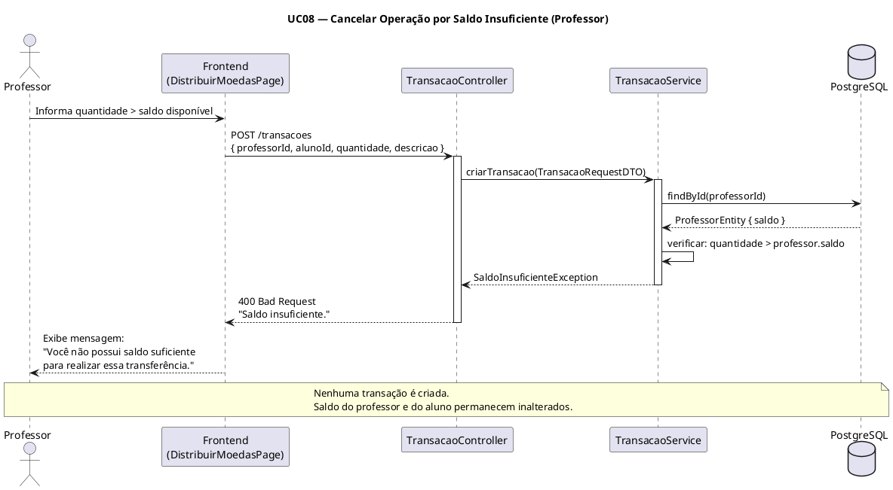
```plantuml
@startuml UC08 - Cancelar Operacao Saldo Insuficiente Professor
title UC08 — Cancelar Operação por Saldo Insuficiente (Professor)

actor "Professor" as P
participant "Frontend\n(DistribuirMoedasPage)" as FE
participant "TransacaoController" as TC
participant "TransacaoService" as TS
database "PostgreSQL" as DB

P -> FE: Informa quantidade > saldo disponível
FE -> TC: POST /transacoes\n{ professorId, alunoId, quantidade, descricao }
activate TC

TC -> TS: criarTransacao(TransacaoRequestDTO)
activate TS

TS -> DB: findById(professorId)
DB --> TS: ProfessorEntity { saldo }

TS -> TS: verificar: quantidade > professor.saldo

TS --> TC: SaldoInsuficienteException
deactivate TS

TC --> FE: 400 Bad Request\n"Saldo insuficiente."
deactivate TC

FE --> P: Exibe mensagem:\n"Você não possui saldo suficiente\npara realizar essa transferência."

note over P, DB: Nenhuma transação é criada.\nSaldo do professor e do aluno permanecem inalterados.
@enduml
```

---

## UC09 — Consultar Extrato

> **Ator:** Aluno ou Professor  
> **Trigger:** Usuário acessa a tela de extrato no seu dashboard

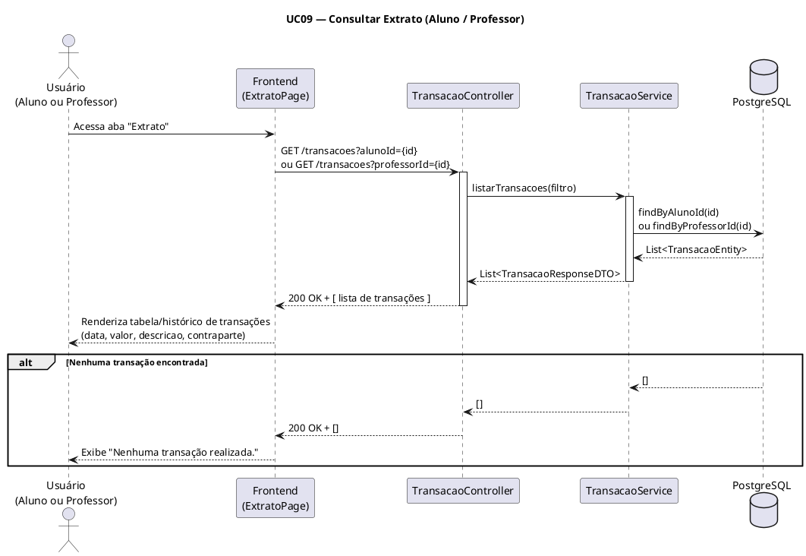
```plantuml
@startuml UC09 - Consultar Extrato
title UC09 — Consultar Extrato (Aluno / Professor)

actor "Usuário\n(Aluno ou Professor)" as U
participant "Frontend\n(ExtratoPage)" as FE
participant "TransacaoController" as TC
participant "TransacaoService" as TS
database "PostgreSQL" as DB

U -> FE: Acessa aba "Extrato"
FE -> TC: GET /transacoes?alunoId={id}\nou GET /transacoes?professorId={id}
activate TC

TC -> TS: listarTransacoes(filtro)
activate TS

TS -> DB: findByAlunoId(id)\nou findByProfessorId(id)
DB --> TS: List<TransacaoEntity>

TS --> TC: List<TransacaoResponseDTO>
deactivate TS

TC --> FE: 200 OK + [ lista de transações ]
deactivate TC

FE --> U: Renderiza tabela/histórico de transações\n(data, valor, descricao, contraparte)

alt Nenhuma transação encontrada
    DB --> TS: []
    TS --> TC: []
    TC --> FE: 200 OK + []
    FE --> U: Exibe "Nenhuma transação realizada."
end
@enduml
```

---

## UC10 — Receber Moedas (Aluno)

> **Ator:** Aluno  
> **Trigger:** Professor conclui UC07; aluno visualiza o saldo atualizado ao entrar no dashboard

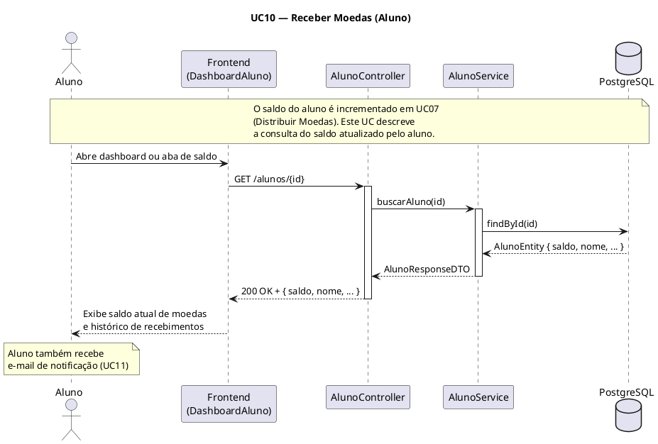
```plantuml
@startuml UC10 - Receber Moedas Aluno
title UC10 — Receber Moedas (Aluno)

actor "Aluno" as A
participant "Frontend\n(DashboardAluno)" as FE
participant "AlunoController" as AC
participant "AlunoService" as AS
database "PostgreSQL" as DB

note over A, DB: O saldo do aluno é incrementado em UC07\n(Distribuir Moedas). Este UC descreve\na consulta do saldo atualizado pelo aluno.

A -> FE: Abre dashboard ou aba de saldo
FE -> AC: GET /alunos/{id}
activate AC

AC -> AS: buscarAluno(id)
activate AS

AS -> DB: findById(id)
DB --> AS: AlunoEntity { saldo, nome, ... }

AS --> AC: AlunoResponseDTO
deactivate AS

AC --> FE: 200 OK + { saldo, nome, ... }
deactivate AC

FE --> A: Exibe saldo atual de moedas\ne histórico de recebimentos

note over A: Aluno também recebe\ne-mail de notificação (UC11)
@enduml
```

---

## UC11 — Notificar Aluno por E-mail

> **Ator:** Sistema (EmailService)  
> **Trigger:** Disparado de forma assíncrona ao final do UC07 (Distribuir Moedas)

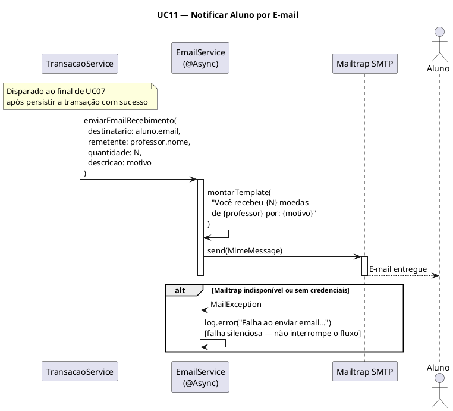
```plantuml
@startuml UC11 - Notificar Aluno por Email
title UC11 — Notificar Aluno por E-mail

participant "TransacaoService" as TS
participant "EmailService\n(@Async)" as ES
participant "Mailtrap SMTP" as SMTP
actor "Aluno" as A

note over TS: Disparado ao final de UC07\napós persistir a transação com sucesso

TS -> ES: enviarEmailRecebimento(\n  destinatario: aluno.email,\n  remetente: professor.nome,\n  quantidade: N,\n  descricao: motivo\n)
activate ES

ES -> ES: montarTemplate(\n  "Você recebeu {N} moedas\n  de {professor} por: {motivo}"\n)

ES -> SMTP: send(MimeMessage)
activate SMTP
SMTP --> A: E-mail entregue
deactivate SMTP

deactivate ES

alt Mailtrap indisponível ou sem credenciais
    SMTP --> ES: MailException
    ES -> ES: log.error("Falha ao enviar email...")\n[falha silenciosa — não interrompe o fluxo]
end
@enduml
```

---

## UC12 — Resgatar Vantagem (Aluno)

> **Ator:** Aluno  
> **Trigger:** Aluno seleciona uma vantagem disponível e confirma o resgate

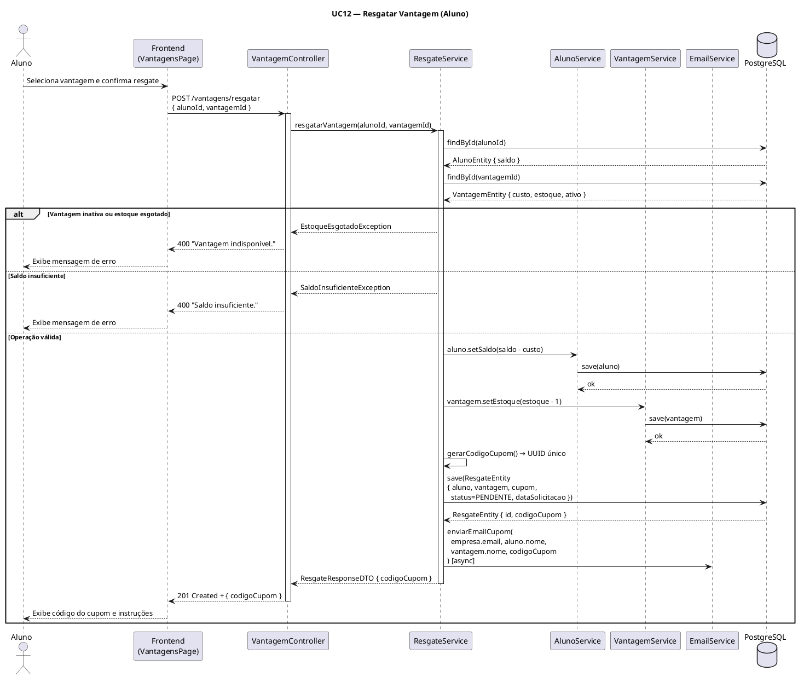
```plantuml
@startuml UC12 - Resgatar Vantagem
title UC12 — Resgatar Vantagem (Aluno)

actor "Aluno" as A
participant "Frontend\n(VantagensPage)" as FE
participant "VantagemController" as VC
participant "ResgateService" as RS
participant "AlunoService" as AS
participant "VantagemService" as VS
participant "EmailService" as ES
database "PostgreSQL" as DB

A -> FE: Seleciona vantagem e confirma resgate
FE -> VC: POST /vantagens/resgatar\n{ alunoId, vantagemId }
activate VC

VC -> RS: resgatarVantagem(alunoId, vantagemId)
activate RS

RS -> DB: findById(alunoId)
DB --> RS: AlunoEntity { saldo }

RS -> DB: findById(vantagemId)
DB --> RS: VantagemEntity { custo, estoque, ativo }

alt Vantagem inativa ou estoque esgotado
    RS --> VC: EstoqueEsgotadoException
    VC --> FE: 400 "Vantagem indisponível."
    FE --> A: Exibe mensagem de erro
else Saldo insuficiente
    RS --> VC: SaldoInsuficienteException
    VC --> FE: 400 "Saldo insuficiente."
    FE --> A: Exibe mensagem de erro
else Operação válida
    RS -> AS: aluno.setSaldo(saldo - custo)
    AS -> DB: save(aluno)
    DB --> AS: ok

    RS -> VS: vantagem.setEstoque(estoque - 1)
    VS -> DB: save(vantagem)
    DB --> VS: ok

    RS -> RS: gerarCodigoCupom() → UUID único

    RS -> DB: save(ResgateEntity\n{ aluno, vantagem, cupom,\n  status=PENDENTE, dataSolicitacao })
    DB --> RS: ResgateEntity { id, codigoCupom }

    RS -> ES: enviarEmailCupom(\n  empresa.email, aluno.nome,\n  vantagem.nome, codigoCupom\n) [async]

    RS --> VC: ResgateResponseDTO { codigoCupom }
    deactivate RS
    VC --> FE: 201 Created + { codigoCupom }
    deactivate VC
    FE --> A: Exibe código do cupom e instruções
end
@enduml
```

---

## UC13 — Cancelar Operação por Saldo Insuficiente (Aluno)

> **Ator:** Aluno  
> **Trigger:** Aluno tenta resgatar uma vantagem sem saldo suficiente ou com estoque esgotado

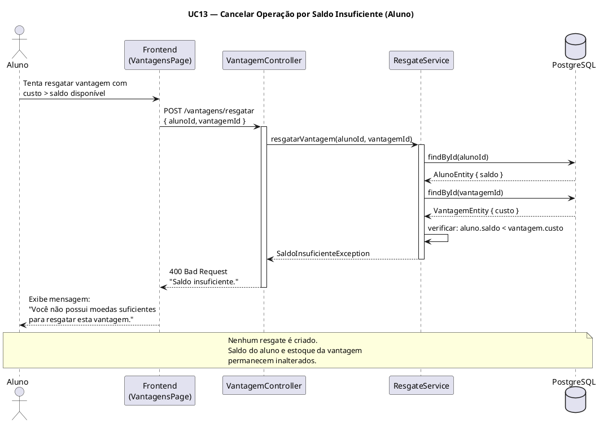
```plantuml
@startuml UC13 - Cancelar Operacao Saldo Insuficiente Aluno
title UC13 — Cancelar Operação por Saldo Insuficiente (Aluno)

actor "Aluno" as A
participant "Frontend\n(VantagensPage)" as FE
participant "VantagemController" as VC
participant "ResgateService" as RS
database "PostgreSQL" as DB

A -> FE: Tenta resgatar vantagem com\ncusto > saldo disponível
FE -> VC: POST /vantagens/resgatar\n{ alunoId, vantagemId }
activate VC

VC -> RS: resgatarVantagem(alunoId, vantagemId)
activate RS

RS -> DB: findById(alunoId)
DB --> RS: AlunoEntity { saldo }

RS -> DB: findById(vantagemId)
DB --> RS: VantagemEntity { custo }

RS -> RS: verificar: aluno.saldo < vantagem.custo

RS --> VC: SaldoInsuficienteException
deactivate RS

VC --> FE: 400 Bad Request\n"Saldo insuficiente."
deactivate VC

FE --> A: Exibe mensagem:\n"Você não possui moedas suficientes\npara resgatar esta vantagem."

note over A, DB: Nenhum resgate é criado.\nSaldo do aluno e estoque da vantagem\npermanecem inalterados.
@enduml
```

---

## UC14 — Enviar E-mail de Confirmação de Resgate

> **Ator:** Sistema (EmailService)  
> **Trigger:** Disparado de forma assíncrona ao final do UC12 (Resgatar Vantagem)

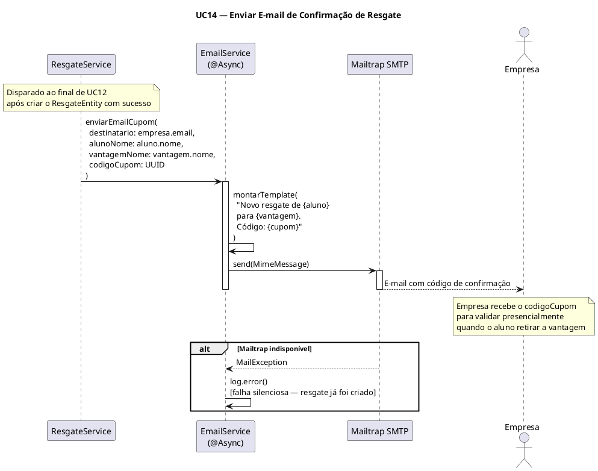
```plantuml
@startuml UC14 - Enviar Email Confirmacao Resgate
title UC14 — Enviar E-mail de Confirmação de Resgate

participant "ResgateService" as RS
participant "EmailService\n(@Async)" as ES
participant "Mailtrap SMTP" as SMTP
actor "Empresa" as E

note over RS: Disparado ao final de UC12\napós criar o ResgateEntity com sucesso

RS -> ES: enviarEmailCupom(\n  destinatario: empresa.email,\n  alunoNome: aluno.nome,\n  vantagemNome: vantagem.nome,\n  codigoCupom: UUID\n)
activate ES

ES -> ES: montarTemplate(\n  "Novo resgate de {aluno}\n  para {vantagem}.\n  Código: {cupom}"\n)

ES -> SMTP: send(MimeMessage)
activate SMTP
SMTP --> E: E-mail com código de confirmação
deactivate SMTP
deactivate ES

note over E: Empresa recebe o codigoCupom\npara validar presencialmente\nquando o aluno retirar a vantagem

alt Mailtrap indisponível
    SMTP --> ES: MailException
    ES -> ES: log.error()\n[falha silenciosa — resgate já foi criado]
end
@enduml
```

---

## UC15 — Cancelar Resgate Expirado

> **Ator:** Sistema (Job agendado)  
> **Trigger:** @Scheduled verifica periodicamente resgates PENDENTE sem confirmação dentro do prazo

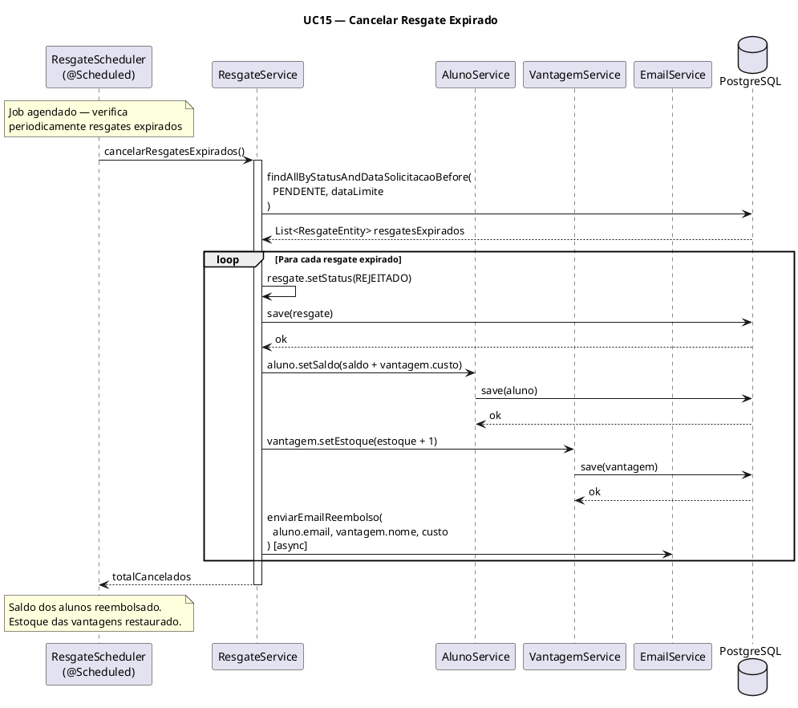
```plantuml
@startuml UC15 - Cancelar Resgate Expirado
title UC15 — Cancelar Resgate Expirado

participant "ResgateScheduler\n(@Scheduled)" as SCHED
participant "ResgateService" as RS
participant "AlunoService" as AS
participant "VantagemService" as VS
participant "EmailService" as ES
database "PostgreSQL" as DB

note over SCHED: Job agendado — verifica\nperiodicamente resgates expirados

SCHED -> RS: cancelarResgatesExpirados()
activate RS

RS -> DB: findAllByStatusAndDataSolicitacaoBefore(\n  PENDENTE, dataLimite\n)
DB --> RS: List<ResgateEntity> resgatesExpirados

loop Para cada resgate expirado
    RS -> RS: resgate.setStatus(REJEITADO)
    RS -> DB: save(resgate)
    DB --> RS: ok

    RS -> AS: aluno.setSaldo(saldo + vantagem.custo)
    AS -> DB: save(aluno)
    DB --> AS: ok

    RS -> VS: vantagem.setEstoque(estoque + 1)
    VS -> DB: save(vantagem)
    DB --> VS: ok

    RS -> ES: enviarEmailReembolso(\n  aluno.email, vantagem.nome, custo\n) [async]
end

RS --> SCHED: totalCancelados
deactivate RS

note over SCHED: Saldo dos alunos reembolsado.\nEstoque das vantagens restaurado.
@enduml
```

---

## UC16 — Comunicar Aluno via E-mail (Reembolso/Cancelamento)

> **Ator:** Sistema (EmailService)  
> **Trigger:** Disparado por UC15 (resgate expirado) ou UC19 (empresa rejeita resgate)

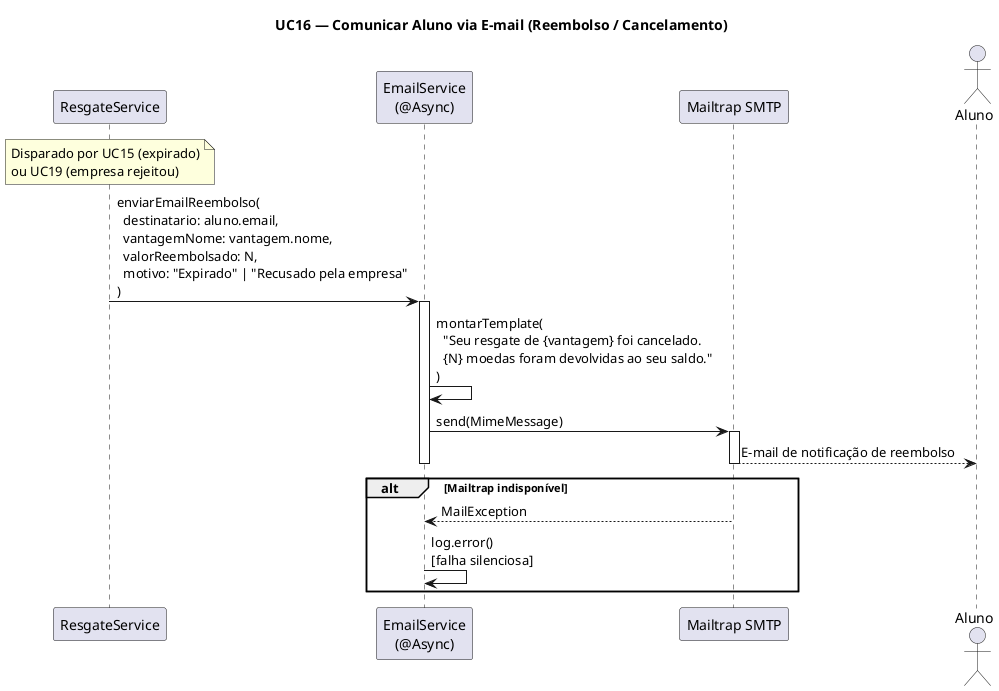
```plantuml
@startuml UC16 - Comunicar Aluno via Email
title UC16 — Comunicar Aluno via E-mail (Reembolso / Cancelamento)

participant "ResgateService" as RS
participant "EmailService\n(@Async)" as ES
participant "Mailtrap SMTP" as SMTP
actor "Aluno" as A

note over RS: Disparado por UC15 (expirado)\nou UC19 (empresa rejeitou)

RS -> ES: enviarEmailReembolso(\n  destinatario: aluno.email,\n  vantagemNome: vantagem.nome,\n  valorReembolsado: N,\n  motivo: "Expirado" | "Recusado pela empresa"\n)
activate ES

ES -> ES: montarTemplate(\n  "Seu resgate de {vantagem} foi cancelado.\n  {N} moedas foram devolvidas ao seu saldo."\n)

ES -> SMTP: send(MimeMessage)
activate SMTP
SMTP --> A: E-mail de notificação de reembolso
deactivate SMTP
deactivate ES

alt Mailtrap indisponível
    SMTP --> ES: MailException
    ES -> ES: log.error()\n[falha silenciosa]
end
@enduml
```

---

## UC17 — Cadastrar Vantagem (Empresa)

> **Ator:** Empresa  
> **Trigger:** Empresa acessa o painel e cria/edita/remove uma vantagem

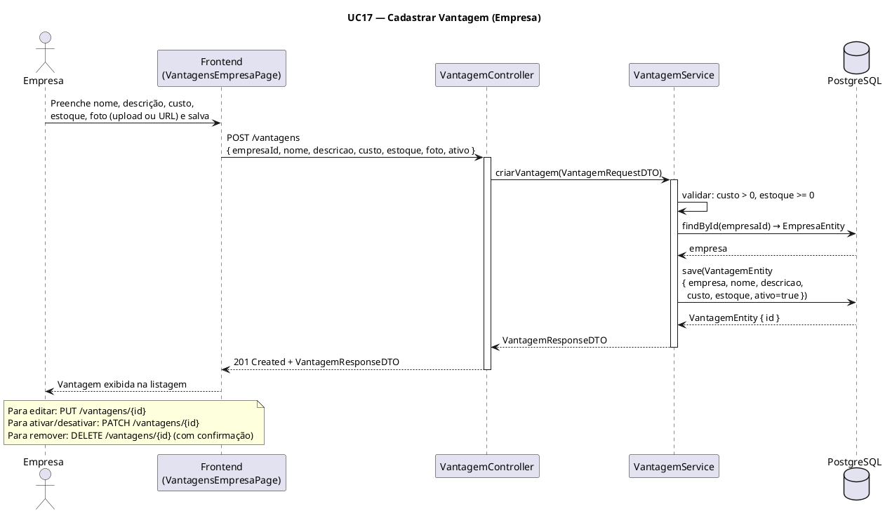
```plantuml
@startuml UC17 - Cadastrar Vantagem
title UC17 — Cadastrar Vantagem (Empresa)

actor "Empresa" as E
participant "Frontend\n(VantagensEmpresaPage)" as FE
participant "VantagemController" as VC
participant "VantagemService" as VS
database "PostgreSQL" as DB

E -> FE: Preenche nome, descrição, custo,\nestoque, foto (upload ou URL) e salva
FE -> VC: POST /vantagens\n{ empresaId, nome, descricao, custo, estoque, foto, ativo }
activate VC

VC -> VS: criarVantagem(VantagemRequestDTO)
activate VS

VS -> VS: validar: custo > 0, estoque >= 0
VS -> DB: findById(empresaId) → EmpresaEntity
DB --> VS: empresa

VS -> DB: save(VantagemEntity\n{ empresa, nome, descricao,\n  custo, estoque, ativo=true })
DB --> VS: VantagemEntity { id }

VS --> VC: VantagemResponseDTO
deactivate VS
VC --> FE: 201 Created + VantagemResponseDTO
deactivate VC
FE --> E: Vantagem exibida na listagem

note over E, FE: Para editar: PUT /vantagens/{id}\nPara ativar/desativar: PATCH /vantagens/{id}\nPara remover: DELETE /vantagens/{id} (com confirmação)
@enduml
```

---

## UC18 — Confirmar Resgate (Empresa)

> **Ator:** Empresa  
> **Trigger:** Aluno apresenta o codigoCupom presencialmente; empresa confirma no sistema

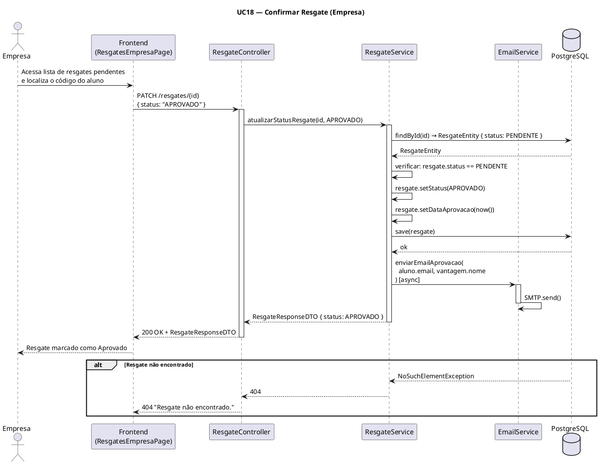
```plantuml
@startuml UC18 - Confirmar Resgate
title UC18 — Confirmar Resgate (Empresa)

actor "Empresa" as E
participant "Frontend\n(ResgatesEmpresaPage)" as FE
participant "ResgateController" as RC
participant "ResgateService" as RS
participant "EmailService" as ES
database "PostgreSQL" as DB

E -> FE: Acessa lista de resgates pendentes\ne localiza o código do aluno
FE -> RC: PATCH /resgates/{id}\n{ status: "APROVADO" }
activate RC

RC -> RS: atualizarStatusResgate(id, APROVADO)
activate RS

RS -> DB: findById(id) → ResgateEntity { status: PENDENTE }
DB --> RS: ResgateEntity

RS -> RS: verificar: resgate.status == PENDENTE
RS -> RS: resgate.setStatus(APROVADO)
RS -> RS: resgate.setDataAprovacao(now())
RS -> DB: save(resgate)
DB --> RS: ok

RS -> ES: enviarEmailAprovacao(\n  aluno.email, vantagem.nome\n) [async]
activate ES
ES -> ES: SMTP.send()
deactivate ES

RS --> RC: ResgateResponseDTO { status: APROVADO }
deactivate RS
RC --> FE: 200 OK + ResgateResponseDTO
deactivate RC
FE --> E: Resgate marcado como Aprovado

alt Resgate não encontrado
    DB --> RS: NoSuchElementException
    RS --> RC: 404
    RC --> FE: 404 "Resgate não encontrado."
end
@enduml
```

---

## UC19 — Reembolsar Aluno (Empresa rejeita resgate)

> **Ator:** Empresa  
> **Trigger:** Empresa recusa o cupom apresentado pelo aluno (cupom inválido, vantagem indisponível etc.)

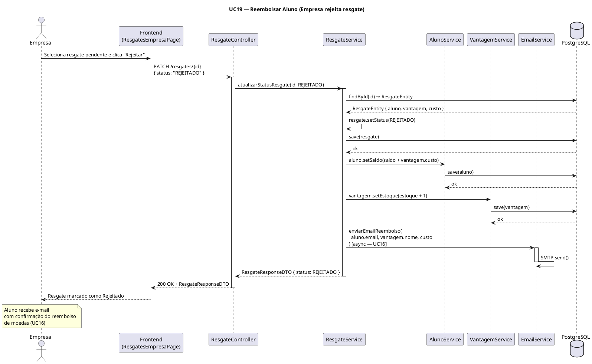
```plantuml
@startuml UC19 - Reembolsar Aluno
title UC19 — Reembolsar Aluno (Empresa rejeita resgate)

actor "Empresa" as E
participant "Frontend\n(ResgatesEmpresaPage)" as FE
participant "ResgateController" as RC
participant "ResgateService" as RS
participant "AlunoService" as AS
participant "VantagemService" as VS
participant "EmailService" as ES
database "PostgreSQL" as DB

E -> FE: Seleciona resgate pendente e clica "Rejeitar"
FE -> RC: PATCH /resgates/{id}\n{ status: "REJEITADO" }
activate RC

RC -> RS: atualizarStatusResgate(id, REJEITADO)
activate RS

RS -> DB: findById(id) → ResgateEntity
DB --> RS: ResgateEntity { aluno, vantagem, custo }

RS -> RS: resgate.setStatus(REJEITADO)
RS -> DB: save(resgate)
DB --> RS: ok

RS -> AS: aluno.setSaldo(saldo + vantagem.custo)
AS -> DB: save(aluno)
DB --> AS: ok

RS -> VS: vantagem.setEstoque(estoque + 1)
VS -> DB: save(vantagem)
DB --> VS: ok

RS -> ES: enviarEmailReembolso(\n  aluno.email, vantagem.nome, custo\n) [async — UC16]
activate ES
ES -> ES: SMTP.send()
deactivate ES

RS --> RC: ResgateResponseDTO { status: REJEITADO }
deactivate RS
RC --> FE: 200 OK + ResgateResponseDTO
deactivate RC
FE --> E: Resgate marcado como Rejeitado

note over E: Aluno recebe e-mail\ncom confirmação do reembolso\nde moedas (UC16)
@enduml
```

